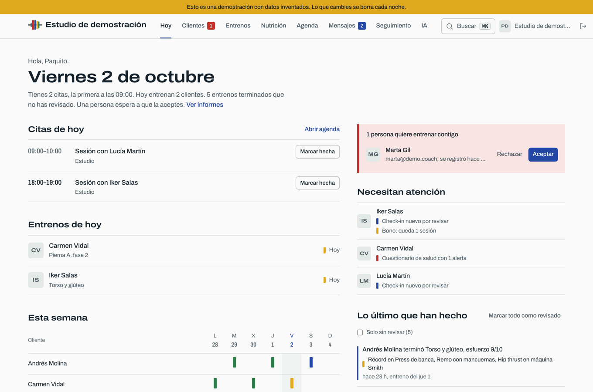
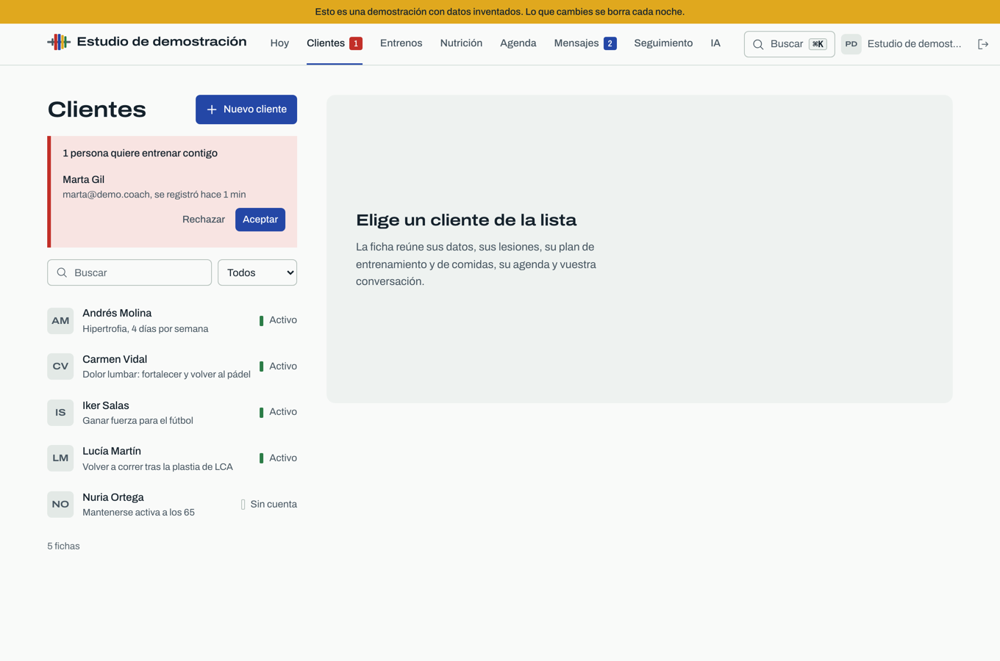
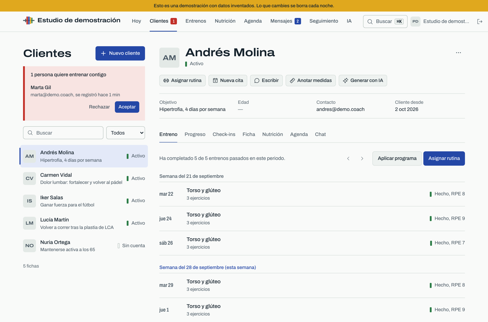
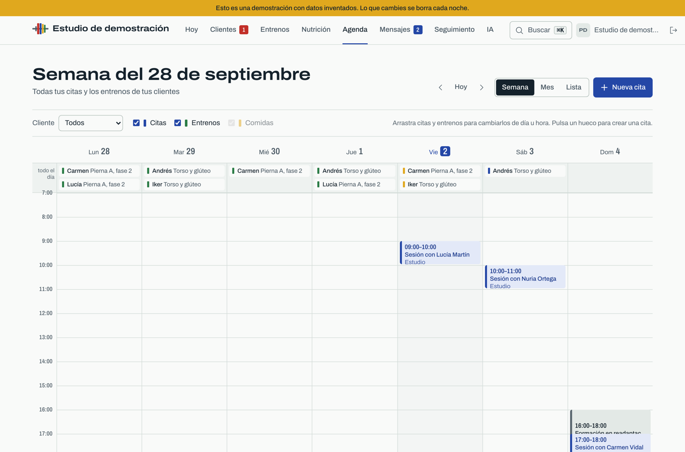
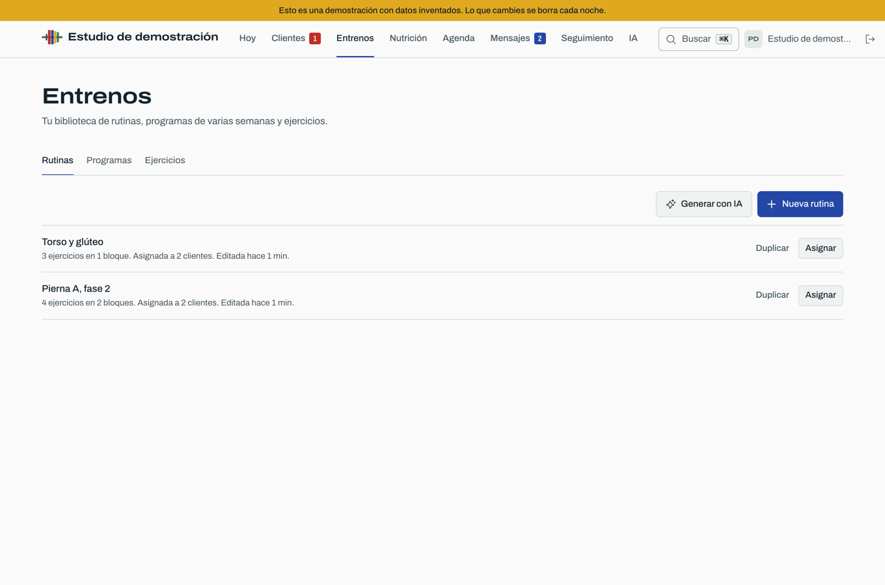
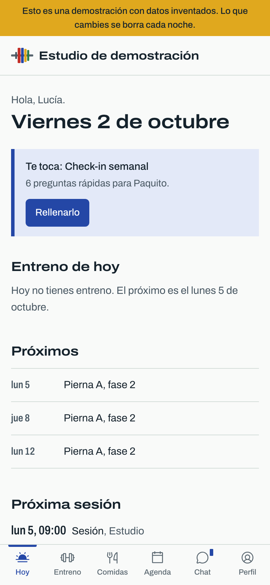
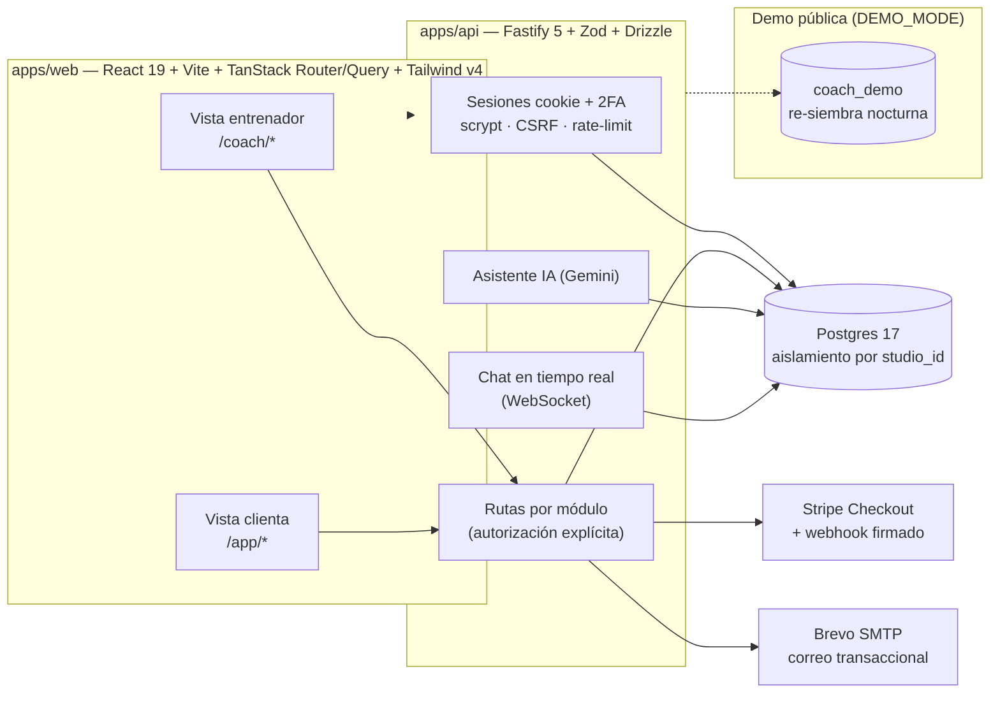

# Paquito Coach

App web para que un entrenador de fuerza y readaptación gestione a sus clientes en un solo
sitio — inspirada en Harbiz: alta y vínculo de clientes, rutinas y programas, plan de comidas,
calendario de citas, chat y cobros. Con **demo pública** de un clic para probarla sin cuenta.



## Dos vistas, una sola app

**Escritorio, para el entrenador** — panel del día (citas, entrenos por revisar, solicitudes),
ficha completa por clienta (entreno, progreso, check-ins, salud, nutrición, agenda y chat),
biblioteca de rutinas y programas de varias semanas, agenda semanal arrastrable y asistente de IA:

| Clientes | Ficha de clienta | Agenda | Entrenos |
|---|---|---|---|
|  |  |  |  |

**Móvil, para la clienta** — su entreno de hoy, próximas citas, comidas, check-ins y chat con el
entrenador, con avisos push:



*Capturas reales de la instancia demo (datos inventados que se re-siembran cada noche).*

## Qué incluye

- **Clientes**: alta por invitación, ficha con lesiones y objetivos, medidas y fotos de progreso,
  check-ins periódicos con alertas, cuaderno de seguimiento.
- **Entrenamiento**: rutinas con progresión de cargas, programas de varias semanas, semana de
  entrenos por clienta, récords y material descargable para la clienta.
- **Nutrición**: plan de comidas por clienta con intercambios.
- **Agenda**: citas y sesiones con bonos de sesiones, reserva y pago online (Stripe), asistencia.
- **Comunicación**: chat privado en tiempo real con fotos y avisos push (Web Push).
- **Seguridad de verdad**: sesiones con cookie `__Host`, 2FA (TOTP), verificación de correo,
  acceso por defecto denegado, aislamiento total por estudio, auditoría de acciones sensibles y
  RGPD (exportación y borrado de datos).
- **IA**: generación de rutinas a partir de los documentos del entrenador (Gemini, en el servidor,
  nunca en el navegador de la clienta).
- **Demo pública**: instancia aparte con datos de ejemplo, entrada con un clic y re-siembra
  nocturna.

## Cómo está hecho



- **Contrato compartido**: los esquemas Zod viven en `packages/shared` y los usan la API (valida
  entrada/salida) y la web (tipos) — nada de tipos duplicados.
- **Tests**: Vitest contra Postgres real (API y web) y Playwright + axe contra la build de
  producción, e2e incluidos de la demo.
- **Despliegue**: imagen Docker amd64 construida en el Mac, subida por SSH al VPS y vuelta atrás
  automática si `/health` no responde (`node tools/deploy.mjs X.Y.Z`); detrás de Cloudflare Tunnel.

## Documentación

- **Estado y siguiente paso**: [`docs/ESTADO.md`](docs/ESTADO.md)
- **Qué incluye el MVP** (para Paquito): [`docs/producto/mvp.md`](docs/producto/mvp.md)
- **Cómo trabajar en el código** (humanos y agentes): [`AGENTS.md`](AGENTS.md)
- Arquitectura: [`docs/arquitectura.md`](docs/arquitectura.md) · API: [`docs/api/`](docs/api/README.md) · Seguridad: [`docs/seguridad.md`](docs/seguridad.md) · Operaciones: [`docs/OPERACIONES.md`](docs/OPERACIONES.md) · Diseño: [`docs/diseno.md`](docs/diseno.md) · Decisiones: [`docs/adr/`](docs/adr/)

## Arrancar en local

```sh
export PATH="/opt/homebrew/opt/node@22/bin:$PATH"
pnpm install && pnpm db:up && cp .env.example .env && echo SETUP_CODE=dev >> .env
pnpm dev:api & pnpm dev:web     # http://localhost:5173
```

Verificación completa antes de dar algo por hecho: `pnpm typecheck && pnpm test && pnpm build && pnpm e2e`.

## Licencia

[MIT](LICENSE) © José Luis García Valverde.
