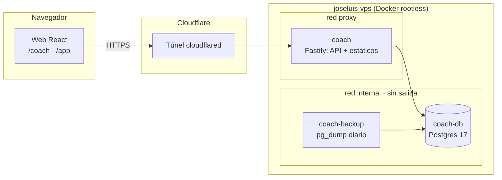
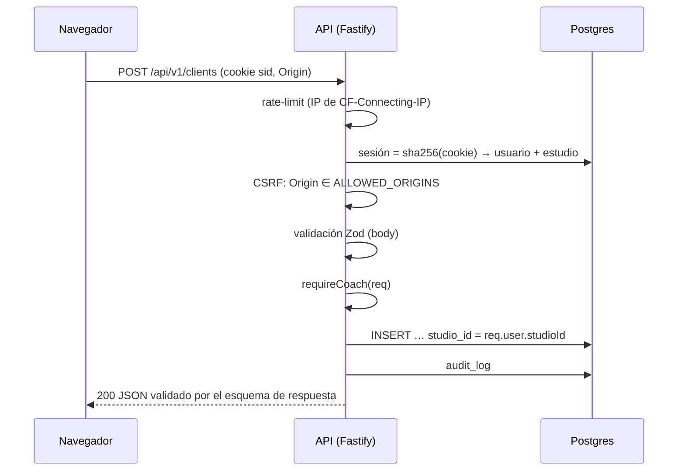
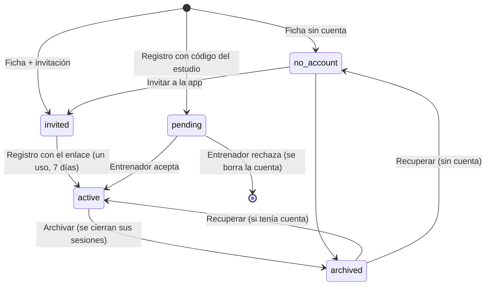
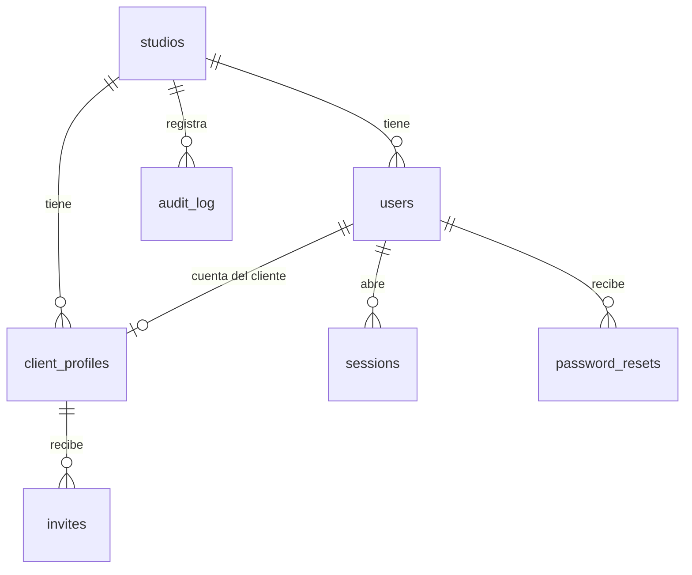

# Arquitectura

## Sistema

- Un solo origen: la API (`/api/v1/*`) y la web estática los sirve el mismo contenedor → **sin CORS**.
- Postgres solo es alcanzable desde la red `internal` (marcada `internal: true`: sin salida a internet). Ningún servicio publica puertos.

## Petición autenticada

## Alta y vínculo de clientes

## Modelo de datos (F1)

Tablas previstas por fase (plan): `exercises`, `routines`, `routine_blocks`, `routine_items`, `workout_assignments`,
`workout_logs`, `set_logs` (F2) · `meal_plans`, `meal_plan_days`, `meals`, `meal_items`, `meal_checks` (F3) ·
`appointments` (F4) · `conversations`, `messages`, `message_reads`, `media`, `push_subscriptions` (F5) · `body_metrics`.

## Tiempo real (F5, previsto)
`@fastify/websocket` en `/ws`, autenticado con la misma cookie. Bus de eventos en memoria (un proceso).
Eventos tipados en `packages/shared` (`message.new`, `message.read`, `workout.completed`…). El cliente, al
reconectar, se pone al día por REST: el socket solo acelera, nunca es la única vía de datos.
